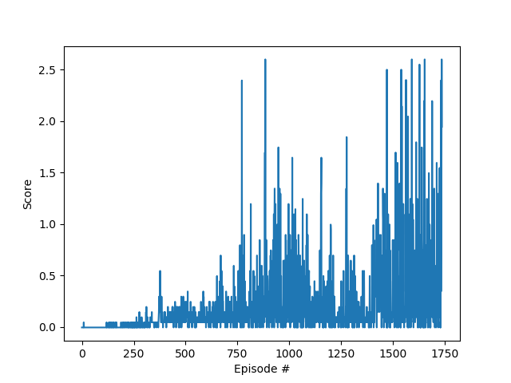

# Report

### Solution Method

For this problem we will use deep deterministic policy gradient (DDPG) algorithm [1]. In this environment we have two agents who, unlike the previous assignements, will play against each other.

The actor network has two hidden layers, both fully connected and with 512, and 256 neurons respectively. Hidden layers use ReLU as activation function; the output layers uses hyperbolic tangent instead.
The critic network has a similar architecture to the actor network, with the main difference in the output layer, consisting of one single value.

Both networks' losses are minimized via Adam optimizer.

Hyperparameters are set as follows: 
replay buffer size = 100000 
batch size = 128 
discount factor = 0.99 
tau = .01 
actor learning rate = .0001   
critic learning rate = .001  
L2 weight decay = 0 

### Results
This environment is considered solved after the agents achieve an average score of +0.5 over 100 episodes. 
With our implementation and hyperparameters choice, the agents achieve this in 1736 episodes (with random seed=0). 
Here a plot of the score development through the episodes.

The training took approximately 1 hour and 13 minutes with an Intel i7-8700K 3.70GHz. 

### Future work and possible improvements
Our goal of +0.5 score was met via a solution similar to Project 2 implementation. Nevertheless, it would be worth to investigate different network architectures, and to perform a more thorough hyperparameter selection in order to achieve a higher score, or the same score in less iterations.
Moreover, DDPG algorithm could be upgraded to a MADDPG to take advantage of the presence of multiple agents, and to aim for a more stable training process.

### Literature
[1] <a href="https://arxiv.org/pdf/1509.02971.pdf" target="_blank">Continuous control with deep reinforcement learning</a> 
[2] <a href="https://arxiv.org/pdf/1706.02275.pdf" target="_blank">Multi-Agent Actor-Critic for Mixed Cooperative-Competitive Environments</a>

